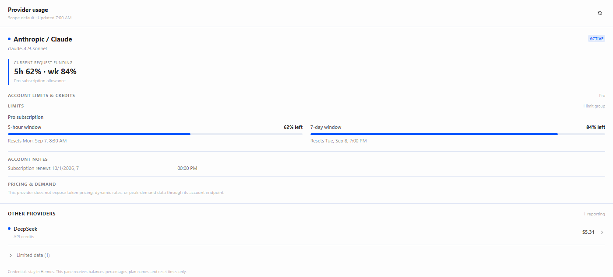
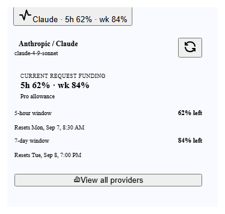

# Hermes Provider Usage

Provider Usage puts the account limit that matters beside the model you are using in Hermes Desktop. The status-bar chip stays compact. **Click it** to see the current provider's details in a popover, and **"View all providers"** opens a full page (like Settings) with every window, reset time, balance, and account detail.

The plugin reports shared provider limits, not usage for one chat. If five sessions use the same Codex account, they all draw from the same allowance.

## Interface previews

These images use sample data, rendered from the plugin's actual components (not hand-written mockups): a real SDK-styled full page and the toolbar popover. The accent follows the active Hermes theme. No real account values appear. See `harness/` for the reproducible capture.





*No real account information appears in these images.*

## What it does

- Adds a small active-provider meter to the bottom-right status area.
- **Click the chip** → a popover shows the current provider's funding summary, governing meters, and reset times.
- **"View all providers"** in that popover → a full Provider Usage page (Settings-style) with every window, balance, and account detail. Reachable too from the sidebar nav row and the ⌘K palette.
- Keeps subscription allowances primary and paid fallback balances secondary.
- Shows every governing window when a model has more than one limit.
- Refreshes the page and status chip against the focused profile and session when switching profiles or bots.
- Keeps API keys and OAuth credentials in the Python backend.
- Marks missing data as unavailable instead of filling gaps with guesses.

A Spark session is a useful example. Spark can have separate 5-hour and weekly limits. The chip shows the resource that can fund the next request, while the page keeps both subscription meters and their reset times visible. An exhausted weekly limit does not make the still-full 5-hour meter disappear.

## Provider support

| Provider | What the plugin can show |
| --- | --- |
| OpenAI Codex | Shared subscription windows, Spark-specific windows, resets, access state, and subdued extra-usage balance when returned |
| OpenCode Go | 5-hour and weekly usage in the status chip; all three subscription windows, including monthly, in the page |
| OpenCode Zen | Authenticated API-credit product state; wallet balance and spend remain unavailable because OpenCode does not expose them to API keys |
| DeepSeek | API balance in the currency returned by DeepSeek |
| OpenRouter | Remaining API credit balance |
| SuperGrok / xAI OAuth | SuperGrok subscription quota and reset data returned by the Grok billing endpoint |
| Nous Portal | Portal credit snapshot when the installed Hermes runtime exposes it |

OpenCode appears as one provider family in the popover/page, but its products stay separate. **Go is subscription-funded. Zen is API-credit-funded.** They use different routes and credentials, and the plugin does not treat one as the other's balance.

The Grok billing response used here exposes quota data but does not provide a trustworthy plan-tier name. The plugin therefore uses the conservative label **SuperGrok** and does not infer a higher tier.

See [PROVIDER_SUPPORT.md](PROVIDER_SUPPORT.md) for tested capabilities, limitations, and the selection rules.

## How the chip chooses a meter

1. Read the provider and model from the focused Hermes session.
2. Use the applicable subscription allowance when one governs that model.
3. Show every governing subscription window in the detailed page.
4. Use paid extra usage or API credits only when a governing subscription window is exhausted or the product is credit-only.
5. Preserve the provider's own currency, timestamps, and unavailable states.

The focused session selects the meter. It does not own a private quota.

## Architecture

```text
Hermes Desktop plugin                Hermes Python plugin
(no credentials)                     (credential boundary)
────────────────────────             ─────────────────────────────
status chip and detail popover/page   ───▶   normalized provider overview
focused provider/model        ◀───   limits, balances, resets, state
```

The renderer never receives API keys, OAuth tokens, authorization headers, or raw credential objects. Provider requests run in the backend through the credentials already configured in Hermes.

## Install

A current Hermes Desktop build and a local Hermes gateway are required.

```bash
export HERMES_HOME="${HERMES_HOME:-$HOME/.hermes}"

mkdir -p "$HERMES_HOME/desktop-plugins/provider-usage"
cp desktop/plugin.js "$HERMES_HOME/desktop-plugins/provider-usage/plugin.js"

mkdir -p "$HERMES_HOME/plugins/provider-usage/dashboard"
cp dashboard/plugin_api.py dashboard/manifest.json \
  "$HERMES_HOME/plugins/provider-usage/dashboard/"
cp -R dashboard/dist "$HERMES_HOME/plugins/provider-usage/dashboard/"
```

Check the current plugin allow-list first:

```bash
hermes config get plugins.enabled
```

Then run `hermes config set plugins.enabled` with the current entries plus `provider-usage`. Do not replace an existing list with the plugin name alone. Recycle the target Hermes gateway after changing the backend allow-list. In Desktop, enable **Provider Usage** under **Settings → Plugins** if it appears as opt-in.

### Backend is per profile

The Python backend (`dashboard/plugin_api.py`) is a **per-profile** install: it loads only when `provider-usage` is in that profile's `plugins.enabled` and its backend folder exists under that profile's `~/.hermes/profiles/<profile>/plugins/provider-usage/dashboard/`. A profile without the backend returns HTTP 404 for `/overview`, and the plugin says exactly that — **"Provider usage isn't enabled or installed in <profile>"** — on both the page and the toolbar chip. It never auto-enables or auto-installs the backend, and never edits a real profile. If you use more than one profile, install and enable the backend in each profile where you want a usage readout.

## Profile scoping & focus divergence

`ctx.rest` reaches the **active** socket's profile and connection, never the focused chat's. The plugin treats a focused session as readable only when its connection-qualified owner (the SDK's `focusedSessionOwner` atom) matches that active source. When a focused chat belongs to a different profile or connection (or the SDK reports the focus as ambiguous), the plugin **fails closed**: the page and chip gate with "The focused chat is in … — switch to view its usage" and issue no fetch or probe for a foreign account — home-account rows are never shown under another account's focus, even when two sources share a profile name. On return to a matching profile, the cached rows for that account come back.

## Development

The shipped plugin file (`desktop/plugin.js`) is plain ESM with **no runtime npm dependencies**, but the dev/test toolchain does: `package.json` declares `devDependencies` `jsdom`, `react`, and `react-dom`, and the real-browser harness (see `harness/README.md`) bundles the plugin with the Hermes desktop SDK source for a faithful component render.

```bash
npm ci          # install the devDependencies (jsdom, react, react-dom)
npm run check   # plugin syntax + jsdom/render/scope/lifecycle suites + dashboard py_compile
# or
bash scripts/validate.sh
```

The browser component harness (real Chromium, real SDK primitives, per-fixture PNG evidence + a lifecycle assertion for the profile round-trip) is separate:

```bash
node harness/build.mjs && node harness/capture.mjs && node harness/verify.mjs
# the toolbar chip → popover interaction is verified by: 
node harness/popover-verify.mjs
```

The fixture suite covers:

- shared Pro Codex limits;
- Spark's 5-hour and weekly limits;
- the Plus 5-hour window;
- DeepSeek API balances;
- OpenCode Go's compact 5-hour/weekly chip and complete three-window page;
- separate OpenCode Go and Zen funding semantics;
- SuperGrok's conservative plan label;
- paid fallback after subscription exhaustion.

## Security

Do not add `.env`, `auth.json`, `config.yaml`, screenshots containing account details, request dumps, or copied provider responses to this repository. Those files are ignored where practical, but the ignore file is a guardrail rather than permission to skip review.

Before publication, the repository is checked for credential-shaped values, authorization material, machine-local paths, generated caches, and unexpected files. The plugin itself is read-only: it reports limits and balances, and it cannot buy credits or enable paid usage.

## Status

This is an experimental plugin. Provider account APIs can change without notice, especially OAuth and web-app endpoints. Stable documented APIs are preferred; experimental adapters are identified in the support table rather than presented as permanent integrations.

## Help wanted

We would love help with this one. The most useful contributions are:

- adapters for more providers, backed by a real account-level usage or balance source;
- testing across different plans and account types without sharing private account data;
- Hermes-native UI work, accessibility fixes, and visual polish;
- fixtures for model-specific limits and unusual reset behavior;
- documentation for provider quirks and honest unavailable states.

Please read [CONTRIBUTING.md](CONTRIBUTING.md) before opening a pull request. Never attach API keys, OAuth tokens, raw provider responses, account screenshots, or request logs to an issue.

## License

[MIT](LICENSE)
